# Java Virtual Vending Machine - JVVM

Although This project supposed to be exercise in basic OOP, I was much more interested in more advanced concepts explored during researching. While looking around OOP paradigm and design patterns on my own, I was particularly attracted by the core concept inspiring OOP – modularity. 
Moreover , I found Automated Testing really attractive idea, implemented previously in Visual Basic calculator app, as at the time , coming from self-taught school of write – build – run -push buttons -see if it breaks, it opened new landscape of possibilities for me saving time spent on assuring that I did not broke anything else that was working before ( manual regression testing :D).

I Used this assignment as exercise in building virtual representation of supposed internals of vending machines, as extra. Assignment required us to focus mainly on aspect of change dispension calculations. Since this part was a piece of cake for me , I desired intellectual stimulation , something that would be challenging enough to feel accomplished and not too complex to not fall out of flow state ( Lets be honest – to not fail whole module, due to overcomplicating the task and giving up midway :D ).

Thus I played with interfaces, observer pattern , and building small nested menu system. Obvoiusly I believe I could do better , by designing more robust or versatile menu system, completely independent from Vending machine logic, and then interfacing it with particulars required by the system.  

# Contents

[Introduction 3](#_Toc532166271)

[System Design 3](#system-design)

[Java Virtual Vending Machine – business logic
4](#java-virtual-vending-machine-business-logic)

[TextUserInterface 7](#textuserinterface)

[Observable Output List 10](#observable-output-list)

[Testing System Requirements 10](#testing-system-requirements)

[Source Code 23](#_Toc532166277)

# Introduction 

Masovic et al.(2012) points numerous advanteges of Java programming
language over its competitors. Portability, prestige, speed and security
offered by Oracle’s product, outweigh high entry threshold and slow
development rate, and made it become a guest in every wallet or
smartphone – by means of Java Card used in SIM cards or Banking Cards
(Edsbacker ,2011).

# System Design

Project is split in two Main modules, with two separate concerns –
Business Logic and User Interaction. JavaVirtualVendingMachine(JVVM for
short and as a field reference thorough) class creates stateful objects
being a facade for all business logic. TextUserInterface is example
implementation of intermediary between JVVM state and user.
TextUserInterface type Object (TUI for short) does not hold any
information about a state of machine, The only dynamic state of TUI
regards PowerUserPassword.

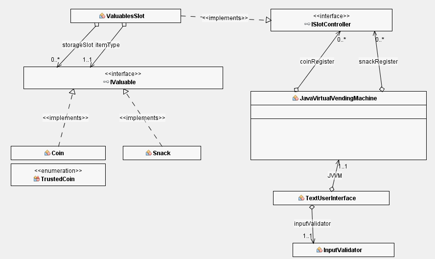

Fig 1. General concept. Coin,TrustedCoin and Snack data objects are
unified as implementations of IValuable interface, and stored in
ValuablesSlot thar **IS A** ISlotController. Vending Machine controls
access to two lists of ISlotControllers. TextUserInterface delegates
dataCollection process to InputValidator.

# Java Virtual Vending Machine – business logic

**Structure**

I decided to program to interfaces as **IS A** relationship and design
structure on the basis of **HAS A** zero to many. This approach let me
implement easy to understand and Object Oriented structure, where
Machine sends and requests data to and from appropriate ISlotControllers
stored in two separate Lists. JVVM remains in a has a relationship with
zero to many ISlotControllers in each register. ISlotController
implementations are expected to control the dispatching and accepting of
Items, and behave as IValuables when asked about the properties of
stored objects. Machine is responsible for validating IValuables
received through insertCoin() method against these properties. If no
appropriate ISlotController was found object is redirected to publicly
accessible Collection coinOutput. All items from coinRegister and
snackRegister are dispensed to respective outputs.

**Implementations:**

Coin, TrustedCoin enum and Snack data objects are unified as
implementations of IValuable interface., and stored in ValuablesSlot.
Trusted Coins are kept in Enum to ensure machine will be initialised
with accurate constant data , and security purposes -
registerValidCoin(TrustedCoin coin) accept only enum type to prevent
misusing the functionality.

ValuablesSlot has a zero to many relationship with items implementing
IValuable interface, not aware of their implementation details and thus
able to treat them polymorphically. ValuablesSlot is an Implementation
of ISlotController interface attempting to partially virtualise physical
components of a typical vending machine slot coil. For this purpose it
wraps and adapts ArrayBlockingQueue member, chosen due to its to
similarity in behaviour and a sufficient ready implementation. Physical
storage slots would have restricted capacity and motors to move content
up to Output opening. Convenient representation of vending coil slot
behaviour is Queue data type, as elements follow FIFO principle(First In
First Out).

In real world scenario ISlotController implementations would control
hardware parts, activating coil motor and reading sensors digital inputs
when use of simple Boolean isEmpty state would be sufficient.

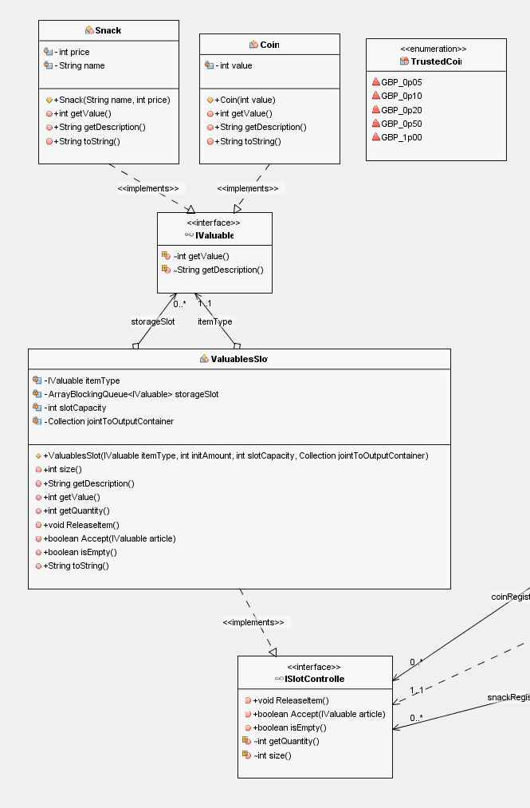

Fig 2. Business logic - detailed structure with members and methods .

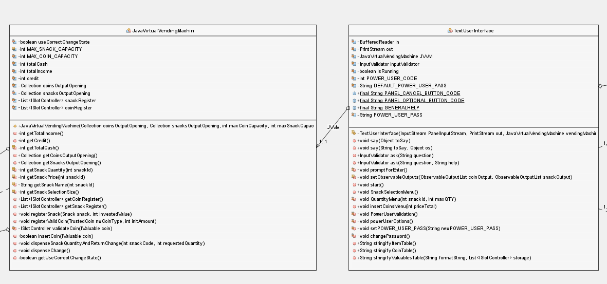

Fig 3.Details of classes JVVM and TUI. TUI **HAS A one to one**
relationship with JVVM regulating behaviour to fit design requirements
(submenus system).

# TextUserInterface

. TextUserInterface class responsibility is to present user with
formatted data requested from JVVM in form of organised submenus.
Dispensing cycle is achieved by creating semi-infinite loop that can be
broken only by accessing PowerUser menu and executing SYSEXIT command.
Similar concept is employed to achieve returning to main menu. If user
enters cancel command or Power user combination, the exception thrown
evacuates stack execution to root level loop and check is performed
against PowerUserCode.

TextUserInterface class delegates data collection and validation
procedures to InputValidator class, and processes or passes parsed data
to respective JVVM method, depending on a current menu.

Input Validator object responsibility is to present user with question
and constrains regarding valid inputs, and, by recursion, repeating the
process until valid input is received. By sharing injected InputStream
and OutputStream dependencies both classes are configurable to work with
common control and display panels.

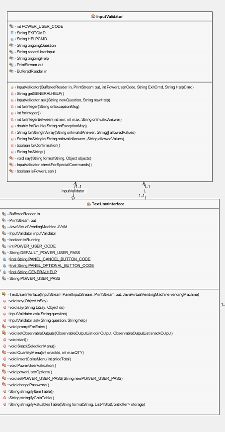

Fig 4.TextUserInterface and InputValidator details

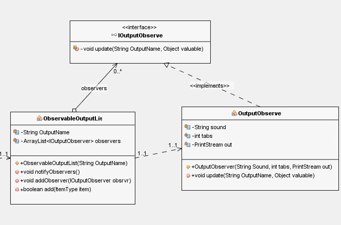

# Observable Output List

Both coinOutput and snackOuptut JavaVirtualVendingMachine member
Collections can be replaced with any DataType implementing its
Interface. As an Experiment in design patterns and trying to implement
decoupling techniques I decided to create observable extension of
ArrayList, allowing to execute independent code on each change in its
state. This allowed TextUserInterface to observe the output of Vending
Machine without polling, and proved helpful in notifying user about
invalid coins being rejected instantly without writing additional code.

# Testing System Requirements

As some of the system requirements regard the same mechanism or feature,
implementation details point to certain illustrations multiple times.
System Requirements and Design Requirements have been separated and
referenced respectively in SR\# , DR\# format. Additionally, captions
under Illustrations contain information which features are presented
within screenshot. Given system requirements refer to each other and
functionalities that already are mentioned

**Design Requirements**

1.  “The user interface will be menu driven, prompting the user to
    select a choice, quantity and subsequently to pay by inserting the
    money”

2.  Depending on the option selected from the main menu, sub menus
    should branch out offering the user different options e.g. if option
    1 from the main menu is selected, a sub menu should appear offering
    the user the choice select a quantity.

> Features implemented: Snack selection menu, quantity menu, coins
> insertion menu.

**System Requirements**

1.  “Decline a transaction if the money for the snack is not paid”.

NOTE:

Design Requirements DR1, DR2 and System Requirement SR6 prevent above
situation from occurring (Illustration 1). For above to exist, System
would need to allow independent or initial coin insertion. Prompting
user to complete transaction after each coin insertion would negatively
impact user experience.

REALISATION:

On User Interface level consideration for user experience has been made,
thus user is presented with total required price for transaction and
option to safely cancel the process at any time. Transaction will not be
finalized unless credit meets the price.

This Requirement is, however, met by implementing declining mechanism on
internal level.

In case of future changes to user interface structure, each feature
attempting to finalize the process must handle
InsufficientFundsException, which effectively declines the current
transaction and meets requirement as stated.

Test Cases: TC1,TC1m

2.  Decline the transaction if the snack is out of stock.

Similarly, to avoid negative user experience, transaction is declined on
the snack selection stage (Illustration 3). Additionally, input
validation prevents user from selecting quantity exceeding stock amount.
Again, as in case of SR1, machine module itself provides safety lock in
case of future changes to TextInterfaceModule. Illustration 5 shows the
test script checking if JavaVirtualVendingMachine
dispenseSnackQuentityAndReturnChange() method throws
OutOfStockException.

Test Cases: TC2,TC3

3.  “Reject a denomination not listed above”.

REALISATION:

Machine accepts only denominations specified: £0.05, £0.10, £0.20,
£0.50, £1.00. stored in TrustedCoin enum.

TestCases: TC4

4.  Dispense a snack if it is in stock and the price has been paid.

REALISATION: implemented - Illustrations 7,8.

Test Cases: TC5

5.  Display the new quantity of the snacks after each purchase

Each time the snack selection cycle begins , the snack register is being
accessed and actual data is formatted and presented in table

REALISATION: implemented - Illustrations 7,2 and 3

Test Cases:TC6m

6.  “coins should be entered one at a time until either the price is met
    or exceeded.”

REALISATION: implemented

One at a time - Illustrations 1,6 (above)

price met exactly (Extreme Value Test Case) - Illustration 7 (above)

Price exceeded – Illustration 8.

Test Cases:TC6,TC7.

7.  Dispense the change if the user has entered more money than the
    price of the snack.

REALISATION: implemented.

Illustrations: 8, 9

Test Cases:TC7

8.  Display an \*\*\*out of stock\*\*\* message if a snack is
    unavailable.

REALISATION: implemented

Illustration: 3 (above)

Test Cases: TC2, TC3

9.  Change should be dispensed using the current stock of change
    available in the machine.

10. The machine should start with a change pool of: 20 Coins for £0.05,
    £0.10, £0.20, £0.50, and 10 coins for £1.00.

Illustrations : 10

11. Pool is topped up from inserted coins.

Illustration: 9

12. A power user feature which can be entered when the power user enters
    from the main menu the option 10976 and then prompting for a
    password taking him/her to a submenu where they can view the total
    amount of money in the machine and the total profit or losses.

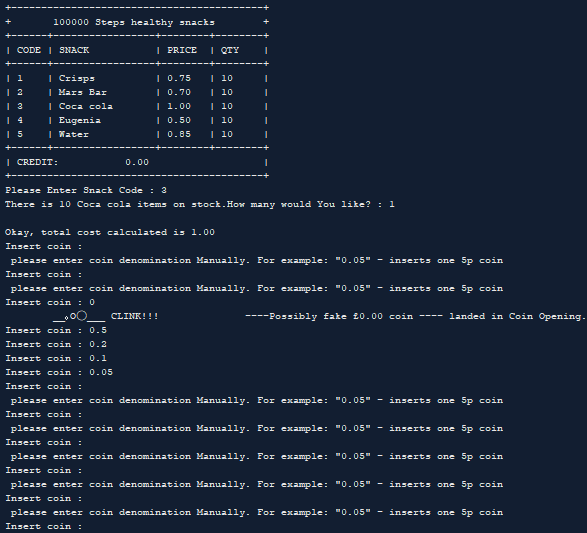

Illustration 1. SR1 - Text User interface keeps asking for coins. Manual
Test. No possibility to dispense snack if price is not covered by
credit. SR6 – coins are inserted one at a time until price is met or
exceeded.

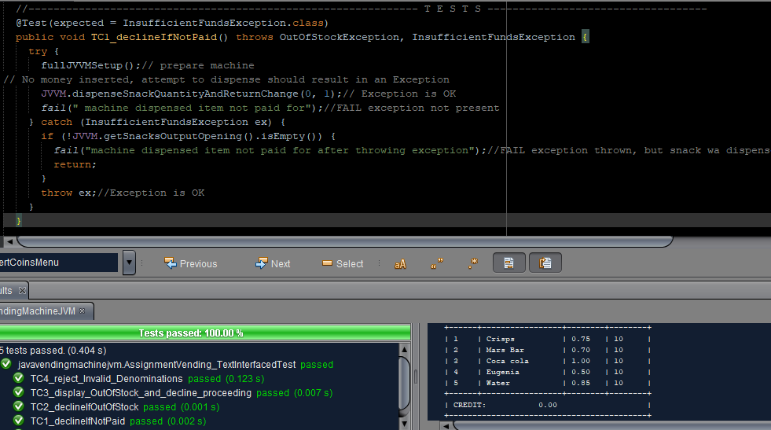

Illustration 2. SR1 – TC1 Test for exception on insufficient Credit.
Automated unit Test

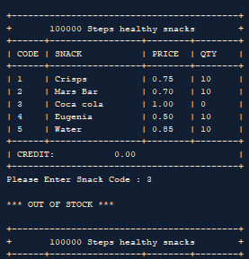

Illustration 3. SR2 - Declines transaction if item is out of stock. SR 8
- Displays \*\*\* OUT OF STOCK \*\*\* message.

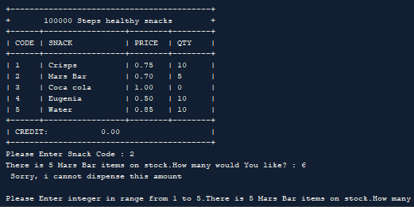

Illustration 4.SR2 - Declines transaction if amount exceed stock
quantity

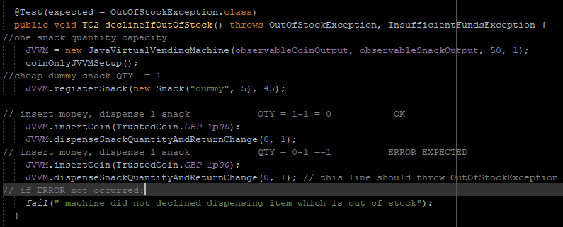

Illustration 5. Automated Test checks if dispensing non-contained item
is possible.

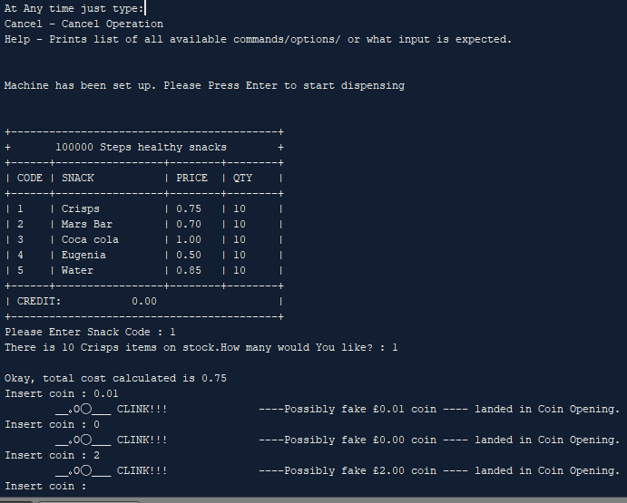

Illustration 6. Denominations that are not registered in machine memory
are being rejected and dispensed to Coin Output.

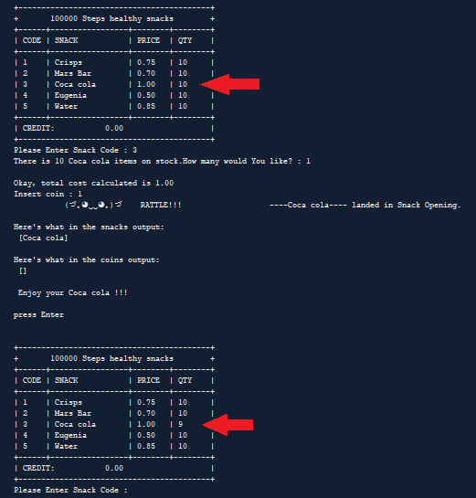

Illustration 7 .SR5 TC6m illustration - displays new Quantity after each
purchase. SR4 – if price is met exactly ,item is dispensed.

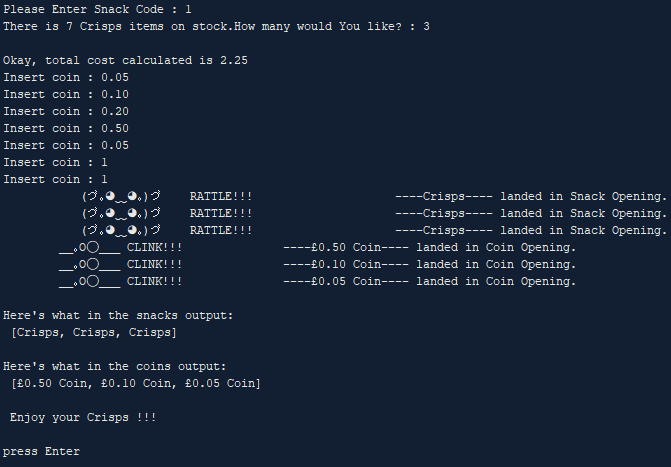

Illustration 8. SR6 – coins inserted one at a time. Price was exceeded ,
and correct change dispensed to coin output. SR4 – items are dispensed
if price is exceeded. SR7 – change is dispensed appropriately.

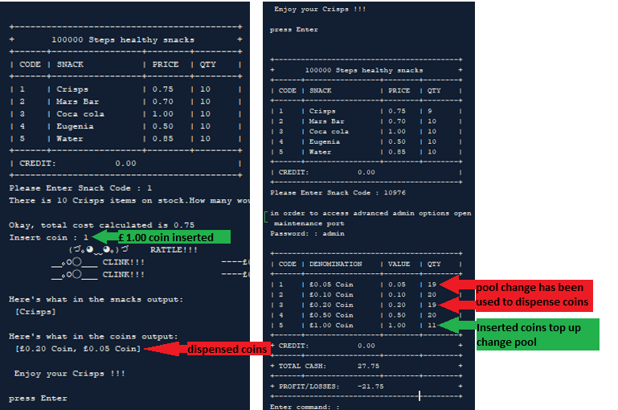

Illustration 9. SR9,SR11 – change is dispensed from the stored pool, and
inserted coins top up the pool change.SR7 – change dispensed on
exceeding credit.

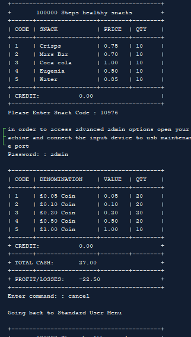

Illustration 10. Power user feature accessed right after initialisation
shows that initial pool change is correct.

> 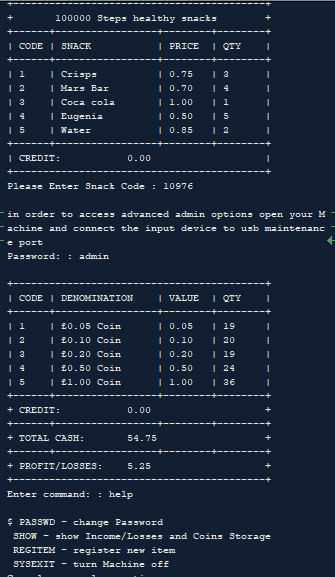

Illustration 11. Power User Root Menu –after multiple purchases and in
initial state.on illustration

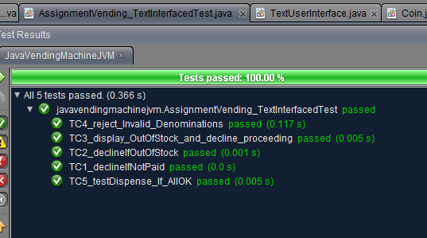

Illustration 12. Automated Tests in JUNIT testing general functionality.

| Conditions                                | Rule 1 | Rule 2 | Rule 3 | Rule 4 |
| ----------------------------------------- | ------ | ------ | ------ | ------ |
| **Credit covers total purchase price**    | F      | T      | F      | T      |
| **Qty required by user can be satisfied** | F      | F      | T      | T      |
| **Snack is Dispensed**                    | F      | F      | F      | T      |

Illustration 13. General Rules for main functionality

<table>
<thead>
<tr class="header">
<th>TC</th>
<th>Conditions</th>
<th>Steps</th>
<th>
Expected

Outcome
</th>
<th>Actual Outcome</th>
<th>Pass/Fail</th>
</tr>
</thead>
<tbody>
<tr class="odd">
<td>1a</td>
<td>Credit &lt; TotalPrice</td>
<td>
No

Place!
</td>
<td>
Transaction

Declined
</td>
<td>Transaction declined</td>
<td>Pass</td>
</tr>
<tr class="even">
<td>1b</td>
<td>Credit&lt;snackPrice</td>
<td></td>
<td>
Transaction

declined
</td>
<td>
Transaction

declined
</td>
<td>pass</td>
</tr>
</tbody>
</table>

References:

Edsbacker , P.(2011) *SIM cards for cellular networks.An introduction to
SIM card application development.* B. Sc. Thesis. Mid Sweden University,
*15 ECTS*

Masovic, S., Saračević, M., Kamberović, H., Kudumovic, M. (2012*). Java
technology in the design and implementation of web applications*.
Technics Technologies Education Management. 7. 504-512. Available from:
https://www.researchgate.net/publication/235788474\_Java\_technology\_in\_the\_design\_and\_implementation\_of\_web\_applications
\[accessed Dec 10 2018\].

Graham, D., Veenendaal, E. and Evans, I. (2008) *Foundations of Software
Testing: ISTQB Certification.* London: Cengage Learning EMEA.
